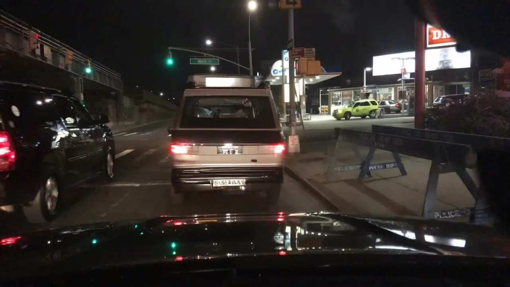
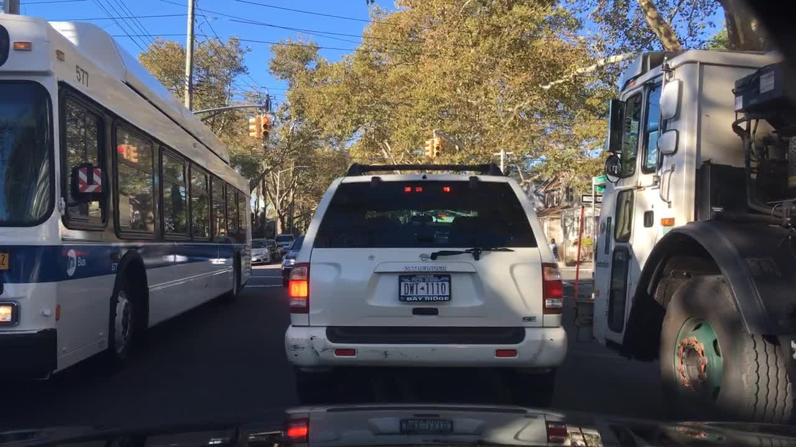

## CIDAUT AI Fake Scene Classification 2024

### Overview

Classify if an autonomous driving scene is real or fake

Given an image, provide the probability of it being real (1) or fake (0)

- Use any model
- Any algorithm for analyzing the images

Description
You need to train neural networks or use any algorithm to classify if an image of a driving scenario is real or fake.

- images are in RGB format compressed in JPEG format.
- labels indicate (1) real and (0) fake
- binary classification
- you can do your own train/validation split
- for the test images, you do not have access to the labels. See sample_submission.csv in the Data section
- code should be in Python

### Evaluation
Submissions are evaluated using AUC-ROC area under the ROC curve between the predicted probability and the observed target.

### Submission File
See in "Data" the sample_submission.csv

this is editada image


this is real image


## Rethink
train funtion
```python
    transform = transforms.Compose([
        transforms.Resize(img_size),
        transforms.ToTensor(),
        transforms.GaussianBlur(7),
        transforms.RandomRotation(degrees=15),
        transforms.RandomHorizontalFlip(),
        transforms.ColorJitter(brightness=0.2, contrast=0.2, saturation=0.2),
        transforms.Normalize(mean=[0.481, 0.457, 0.408], std=[0.268, 0.261, 0.275])
    ])
```
predict funtion
```python
    transform = transforms.Compose([
        transforms.Resize(img_size),
        transforms.ToTensor()
        transforms.Normalize(mean=[0.481, 0.457, 0.408], std=[0.268, 0.261, 0.275]) # need
    ])
```
